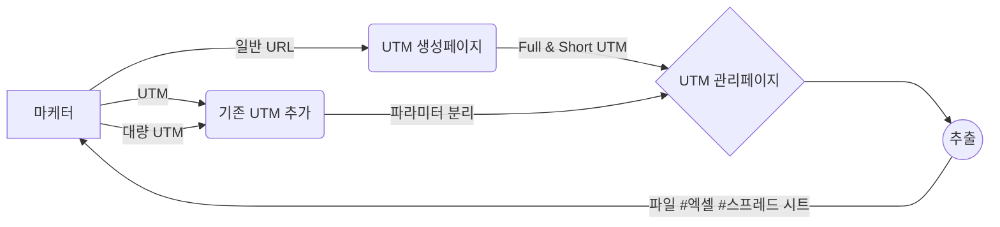

# FRONT-END

# U렉카 - Uwreckcar

# 프로젝트 설명

💡 UTM 링크를 생성하면 해당 링크를 파라미터(소스, 매체, 키워드, 콘텐츠, 이름) 별로 나누어 자동 아카이빙 해 주고, 필요 영역을 설정해 노션 embed, 엑셀, 스프레드 시트 형태로 데이터를 추출하여 팀원들과 공유할 수 있게 해 주는 UTM 카테고라이징 서비스입니다.
[Disquiet\* U렉카 상세보기](https://disquiet.io/product/%EC%9C%A0%EB%A0%89%EC%B9%B4-1679901595623)

### [📌 프로젝트 자세히 보기 (위키)](https://github.com/U-Wreckcar/U-wreckcar-FE/wiki/%F0%9F%93%8C-Project#-%EC%99%80%EC%9D%B4%EC%96%B4-%ED%94%84%EB%A0%88%EC%9E%84)

# 프로젝트 인원

|  역할  | 이름   | 링크                                                                                                                                         |
| :----: | ------ | -------------------------------------------------------------------------------------------------------------------------------------------- |
| **FE** | 신수정 |   |
| **FE** | 김영건 |  |
|   BE   | 김연석 |      |
|   BE   | 김성현 |       |
|   D    | 이주은 | [링크 ](https://2zooni.tistory.com) |                                                                                                         
|   PM   | 강진욱 | [링크](https://disquiet.io/@wlsdnrdl01)                                                                                                      |
|   PM   | 조혜린 | [링크](https://disquiet.io/@jo2050123)                                                                                                       |
|   PM   | 양성민 | [링크](https://disquiet.io/@tjdals931)                                                                                                       |
|   PM   | 이지현 | [링크](https://disquiet.io/@busyh321)                                                                                                        |
|   PM   | 노경택 | [링크](https://disquiet.io/@nohtaek)                                                                                                         |

# 사용한 기술

<!--
<table class="tg">
<thead>
  <tr>
    <td class="tg-nrix" rowspan="2">main</td>
    <td class="tg-0pky"> </td>
    <td class="tg-0pky">javascript</td>
    <td class="tg-0pky"></td>
    <td class="tg-0pky"></td>
  </tr>
  <tr>
    <td class="tg-0pky">react</td>
    <td class="tg-0pky">javascript</td>
    <td class="tg-0pky">typescript</td>
    <td class="tg-0pky">next</td>
  </tr>
</thead>
</table>
# 프론트 주요 작업 -->

  
  
  
  
  
  
  

###

  
  
  

###

  

###

  
  
  

###

