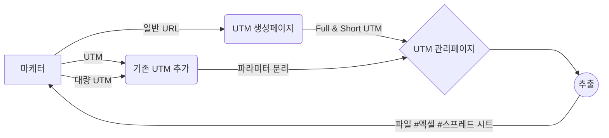

# FRONT-END

## 실행방법

### 1. 설치 <br/>
클론을 받고 아래 명령어를 실행
   ```
   yarn install
   ```
### 2. 실행 <br/>
포트 3000으로 로컬환경에서 실행
```
yarn dev
```
# U렉카 - Uwreckcar


# 프로젝트 설명



💡 UTM 링크를 생성하면 해당 링크를 파라미터(소스, 매체, 키워드, 콘텐츠, 이름) 별로 나누어 자동 아카이빙 해 주고, 필요 영역을 설정해 노션 embed, 엑셀, 스프레드 시트 형태로 데이터를 추출하여 팀원들과 공유할 수 있게 해 주는 UTM 카테고라이징 서비스입니다.
[Disquiet\* U렉카 상세보기](https://disquiet.io/product/%EC%9C%A0%EB%A0%89%EC%B9%B4-1679901595623)

## UTM 카테고라이징 서비스, **유렉카**
GA 사용하기도 벅찬데, UTM 수작업까지 해야돼? 🤷‍♂️
아뇨, UTM 수작업은 유렉카가 도와드리겠습니다. 😉

💡 유렉카는 이런 분들을 위해 만들어졌어요!
- 성장에 목마른 주니어 마케터분들
- 해야 할 일이 많아 1분 1초가 아까운 초기 스타트업 멤버분들

## 📂 핵심 기능 소개
1. UTM 생성 서비스
   홍보하고자하는 URL과 매체, 소스, 캠페인만 정해서 오세요.
   저희가 UTM 링크를 직접 만들어드리고 URL까지 줄여서 홍보에 적합하게 만들어드릴게요!

2. UTM 관리 서비스
   만든 UTM에 대해서 따로 정리해두지 않으셔도 됩니다.
   저희가 깔끔하게 정리까지 도와드릴게요.

3. UTM 추가 서비스
   이미 만들어 둔 UTM이 있으시다구요? 걱정마세요. 기존에 만들어두었던 UTM도
   따로 등록해 함께 관리할 수 있습니다. 메모도 함께 추가해서 관리해보세요!

4. 추출 서비스
   내가 만든 UTM 목록을 공유하고 싶으세요?
   유렉카는 정리해둔 UTM들을 엑셀 파일로 추출까지 해드립니다.
   내가 관리해둔 UTM을 엑셀로 다운받아 팀원들과 공유해보세요!
   <br>

마케터들의 작업 효율을 극대화 시켜주는 유렉카를 사용해보시고
설문도 참여하셔서 신세계 백화점 상품권 받아가세요~🎁

유렉카 페이지 주소 - [utm.works](https://li.urcurly.site/rd/G5opsiZqSD)  
유렉카 이용 가이드 - [U렉카 가이드](https://li.urcurly.site/rd/Fr32COs5rd)  
유렉카 이용자 설문조사 - [U렉카 설문조사 바로가기](https://forms.gle/aTfpMheG96Qkk78P9)  
유렉카 문의하기 - uwreckcar@gmail.com

📢유의사항
- 유렉카 서비스는 현재 MVP 단계의 서비스이며, 매일매일 개선이 이루어지고 있습니다.
- 유렉카는 PC 웹 환경에서만 사용하실 수 있습니다.
  <br>

마케터들의 시간을 항상 소중히 생각하는 유렉카가 되겠습니다.
감사합니다! 😄

### [📌 프로젝트 자세히 보기 (위키)](https://github.com/U-Wreckcar/U-wreckcar-FE/wiki/%F0%9F%93%8C-Project#-%EC%99%80%EC%9D%B4%EC%96%B4-%ED%94%84%EB%A0%88%EC%9E%84)

# 프로젝트 인원

|  역할  | 이름   | 링크                                                                                                                                         |
| :----: | ------ | -------------------------------------------------------------------------------------------------------------------------------------------- |
| **FE** | 신수정 | [ ](https://github.com/new-crystal)  |
| **FE** | 김영건 | [ ](https://github.com/Goldenprevue) |
|   BE   | 김연석 | [ ](https://github.com/tastekim)     |
|   BE   | 김성현 | [ ](https://github.com/rtg1014)      |
|   D    | 이주은 | [링크 ](https://2zooni.tistory.com) |                                                                                                         
|   PM   | 강진욱 | [링크](https://disquiet.io/@wlsdnrdl01)                                                                                                      |
|   PM   | 조혜린 | [링크](https://disquiet.io/@jo2050123)                                                                                                       |
|   PM   | 양성민 | [링크](https://disquiet.io/@tjdals931)                                                                                                       |
|   PM   | 이지현 | [링크](https://disquiet.io/@busyh321)                                                                                                        |
|   PM   | 노경택 | [링크](https://disquiet.io/@nohtaek)                                                                                                         |

# 사용한 기술

<!--
<table class="tg">
<thead>
  <tr>
    <td class="tg-nrix" rowspan="2">main</td>
    <td class="tg-0pky"><a href="https://www.w3schools.com/css/" target="_blank" rel="noreferrer">  </a> </td>
    <td class="tg-0pky">javascript</td>
    <td class="tg-0pky"></td>
    <td class="tg-0pky"></td>
  </tr>
  <tr>
    <td class="tg-0pky">react</td>
    <td class="tg-0pky">javascript</td>
    <td class="tg-0pky">typescript</td>
    <td class="tg-0pky">next</td>
  </tr>
</thead>
</table>
# 프론트 주요 작업 -->


<div align="left">
  
  
  
  
  
  
  
</div>

###

<div align="left">
  
  
  
</div>

###

<div align="left">
  
</div>

###

<div align="left">
  
  
  
</div>

###

