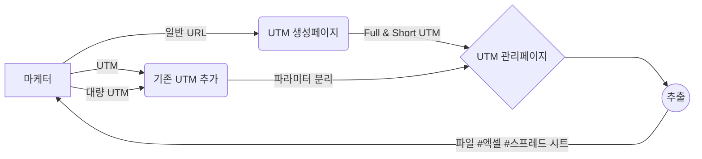

# U렉카 - Uwreckcar

## 프로젝트 설명

[Disquiet\* U렉카 상세보기](https://disquiet.io/product/%EC%9C%A0%EB%A0%89%EC%B9%B4-1679901595623)  
💡 UTM 링크를 생성하면 해당 링크를 파라미터(소스, 매체, 키워드, 콘텐츠, 이름) 별로 나누어 자동 아카이빙 해 주고, 필요 영역을 설정해 노션 embed, 엑셀, 스프레드 시트 형태로 데이터를 추출하여 팀원들과 공유할 수 있게 해 주는 UTM 카테고라이징 서비스입니다.

# 프로젝트 멤버

| 역할   | 이름   | 링크                                                                                                                                                                                           |
| ------ | ------ | ---------------------------------------------------------------------------------------------------------------------------------------------------------------------------------------------- |
| **FE** | 신수정 |                                                     |
| **FE** | 김영건 | https://github.com/Goldenprevue                                                                                                                                                                |
| BE     | 김연석 | https://github.com/tastekim                                                                                                                                                                    |
| BE     | 김성현 | https://github.com/rtg1014                                                                                                                                                                     |
| Design | 이주은 | https://2zooni.tistory.com                                                                                                                                                                     |
| PM     | 강진욱 |  |
| PM     | 조혜린 | https://disquiet.io/@jo2050123                                                                                                                                                                 |
| PM     | 양성민 | https://disquiet.io/@tjdals931                                                                                                                                                                 |
| PM     | 이지현 | https://disquiet.io/@busyh321                                                                                                                                                                  |
| PM     | 노경택 | https://disquiet.io/@nohtaek                                                                                                                                                                   |

<h3>프론트엔드  _신수정
</svg>김영건</h3>
<h3>백엔드: 김상현 김연석(PL)</h3>
<h3>프로덕트매니저: 강진욱 이지현 조혜린 양성민 노경택 </h3>
<h3>프로덕트매니저: 강진욱 이지현 조혜린 양성민 노경택 </h3>

# 프론트 주요 작업

- PM들이 QA하고
